# TRIX + WMA Robustness Evaluation Report

**Primary Ticker:** EURUSD=X

## 1. Problem Framing

Optimizing a trading strategy on a 2D parameter grid (TRIX period × WMA period) often produces a **single bright pixel** that looks impressive in-sample but is fragile: small parameter changes destroy performance.

By adding the SHIFT dimension and evaluating a 3D grid, we expose how that bright pixel fragments across timing perturbations. The solution is to find **plateaus** — regions where the *neighborhood* of parameters performs consistently well.

## 2. Strategy Definition

- **WMA:Weighted Moving Average** (Pullback Setup)

- **TRIX:** Momentum (Trigger)

- **Logic:** Trend-Following Pullback with Regime Filter (SMA200) & ATR Risk Management.

- **Execution:** Signals at close of bar t → fill at open of bar t+1.

## 3. Baselines

### Buy & Hold

| Metric | Buy & Hold |
|--------|---------|
| total_return | -0.2726 |
| cagr | -0.0203 |
| ann_vol | 0.0853 |
| sharpe | -0.2383 |
| max_dd | -0.3535 |
| calmar | -0.0575 |
| n_trades | 1 |
| win_rate | 0.0000 |
| avg_trade_ret | -0.2726 |
| exposure | 1.0000 |

### Buy & Hold + SMA200 Filter

| Metric | BH + SMA200 |
|--------|---------|
| total_return | -0.2085 |
| cagr | -0.0150 |
| ann_vol | 0.0678 |
| sharpe | -0.2208 |
| max_dd | -0.3234 |
| calmar | -0.0463 |
| n_trades | 55 |
| win_rate | 0.1091 |
| avg_trade_ret | -0.0012 |
| exposure | 0.4407 |

## 4. 2D Grid Results

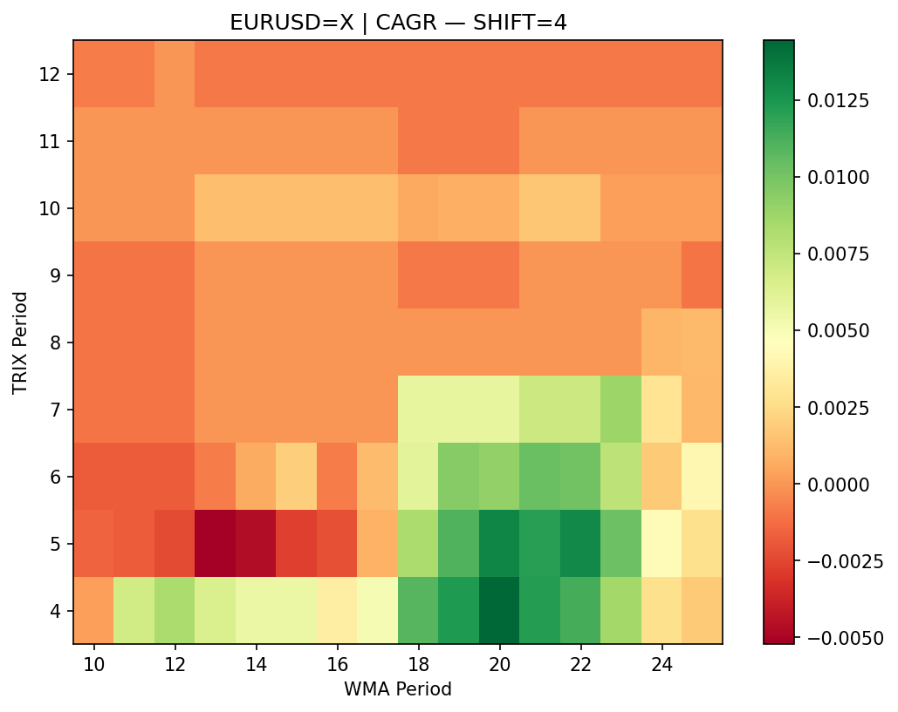

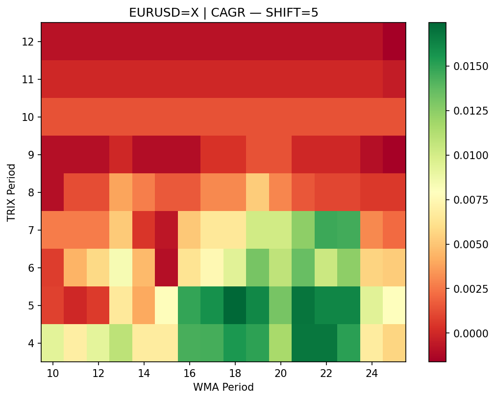

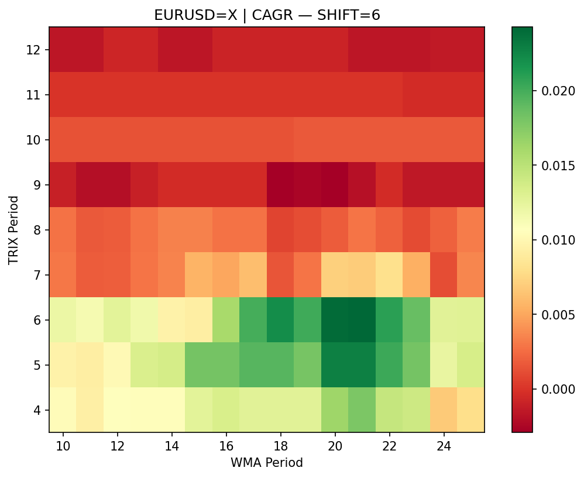

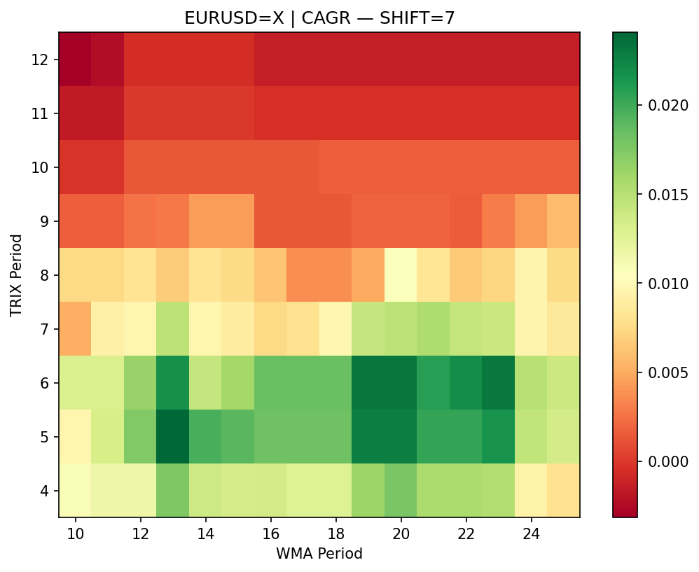

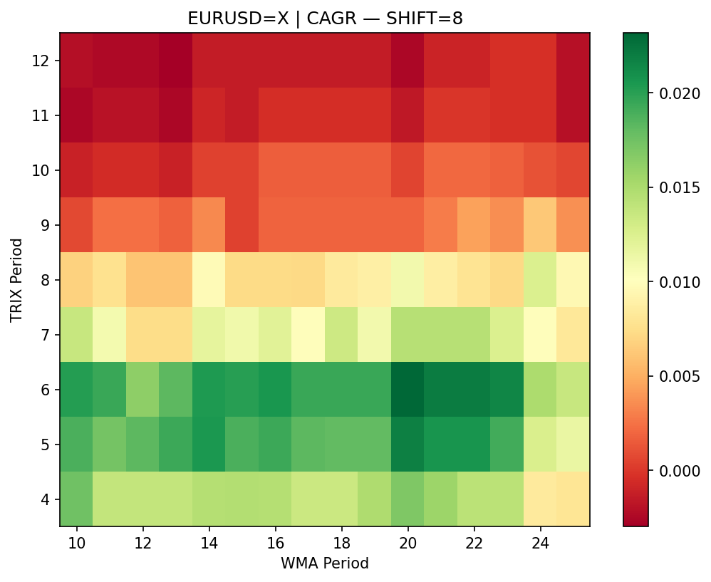

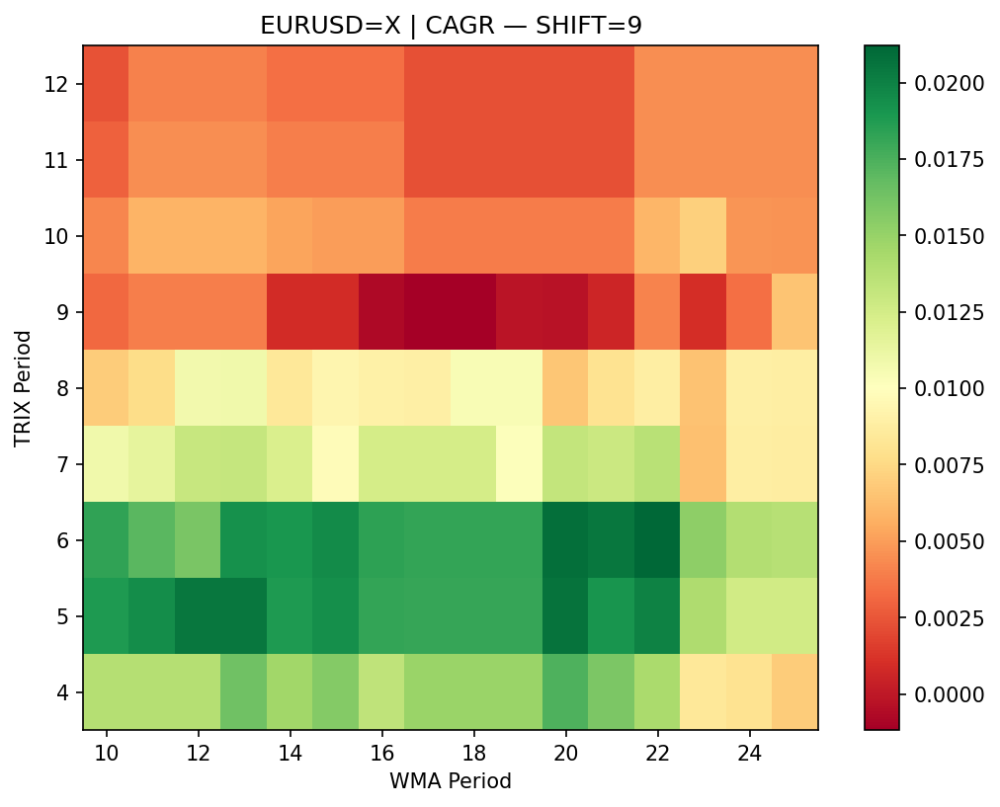

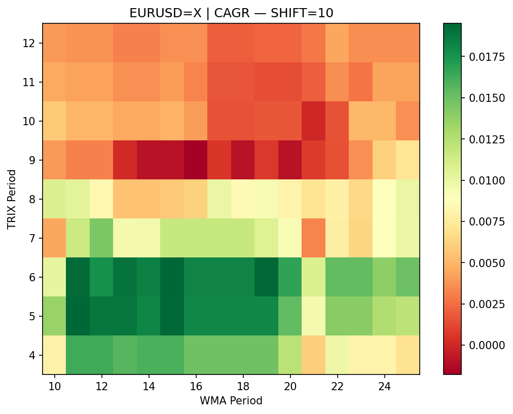

### Best-of-SHIFT Projection

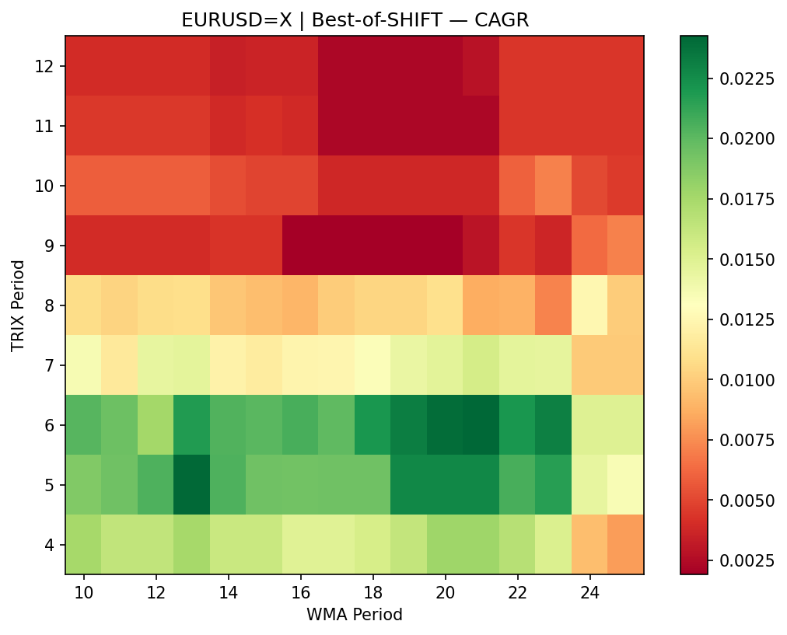

## 5. 3D Results — Fragmentation Across SHIFT

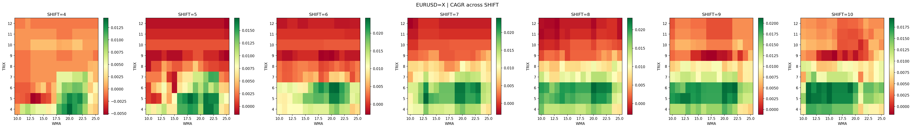

## 6. Plateau Scoring

Score = w₁·norm(median_alpha_CAGR) − w₂·norm(|median_MaxDD|) + w₃·norm(median_Sharpe)
 − w₄·norm(std_alpha_CAGR) + w₅·frac_beating_BH

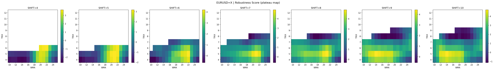

### Top Plateau Centers

| Rank | TRIX | WMA | SHIFT | Score | α-CAGR_med | MaxDD_med | Sharpe_med | α-CAGR_std | BH_frac |
|------|------|-----|-------|-------|------------|-----------|------------|------------|---------|
| 1 | 5 | 21 | 7 | 4.922 | 0.0403 | -0.0780 | 0.724 | 0.0031 | 1.00 |
| 2 | 5 | 21 | 8 | 4.882 | 0.0398 | -0.0779 | 0.711 | 0.0027 | 1.00 |
| 3 | 5 | 20 | 8 | 4.769 | 0.0396 | -0.0803 | 0.705 | 0.0027 | 1.00 |
| 4 | 5 | 14 | 10 | 4.711 | 0.0383 | -0.0809 | 0.665 | 0.0016 | 1.00 |
| 5 | 5 | 20 | 7 | 4.708 | 0.0401 | -0.0816 | 0.720 | 0.0032 | 1.00 |

### Best Pixel vs Best Plateau

- **Best Pixel:** TRIX=6, WMA=21, SHIFT=6 → CAGR=0.0243, α-CAGR=0.0446
- **Best Plateau:** TRIX=5, WMA=21, SHIFT=7 → α-CAGR median=0.0403

## 7. Walk-Forward OOS Results

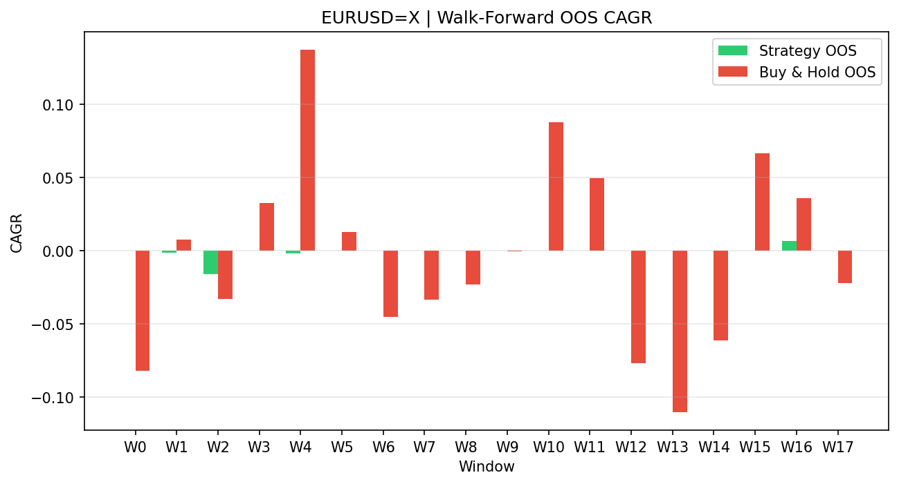

| Window | Test Period | Params | OOS CAGR | OOS Sharpe | OOS MaxDD | Beats BH |
|--------|------------|--------|----------|-----------|----------|----------|
| W0 | 2015-01-08→2016-01-01 | T4/W21/S6 | 0.0000 | 0.000 | 0.0000 | True |
| W1 | 2015-07-08→2016-07-01 | T4/W22/S9 | -0.0011 | -0.157 | -0.0063 | False |
| W2 | 2016-01-08→2016-12-30 | T5/W15/S9 | -0.0157 | -1.263 | -0.0162 | True |
| W3 | 2016-07-08→2017-06-30 | T4/W25/S9 | 0.0000 | 0.000 | 0.0000 | False |
| W4 | 2017-01-09→2018-01-01 | T4/W23/S9 | -0.0019 | -0.170 | -0.0143 | False |
| W5 | 2017-07-10→2018-06-29 | T4/W12/S6 | 0.0000 | 0.000 | 0.0000 | False |
| W6 | 2018-01-08→2019-01-01 | T4/W11/S6 | 0.0000 | 0.000 | 0.0000 | True |
| W7 | 2018-07-09→2019-07-01 | T6/W12/S5 | 0.0000 | 0.000 | 0.0000 | True |
| W8 | 2019-01-08→2020-01-01 | T6/W12/S5 | 0.0000 | 0.000 | 0.0000 | True |
| W9 | 2019-07-08→2020-07-01 | T6/W12/S5 | 0.0000 | 0.000 | 0.0000 | True |
| W10 | 2020-01-08→2021-01-01 | T6/W12/S5 | 0.0000 | 0.000 | 0.0000 | False |
| W11 | 2020-07-08→2021-07-01 | T6/W12/S5 | 0.0000 | 0.000 | 0.0000 | False |
| W12 | 2021-01-08→2021-12-31 | T6/W13/S7 | 0.0000 | 0.000 | 0.0000 | True |
| W13 | 2021-07-08→2022-07-01 | T4/W12/S10 | 0.0000 | 0.000 | 0.0000 | True |
| W14 | 2022-01-10→2022-12-30 | T7/W19/S7 | 0.0000 | 0.000 | 0.0000 | True |
| W15 | 2022-07-08→2023-06-30 | T7/W11/S10 | 0.0000 | 0.000 | 0.0000 | False |
| W16 | 2023-01-09→2024-01-01 | T7/W11/S10 | 0.0065 | 0.658 | -0.0048 | False |
| W17 | 2023-07-10→2024-07-01 | T7/W11/S10 | 0.0000 | 0.000 | 0.0000 | True |

## 8. Multi-Asset Results

| Ticker | TRIX | WMA | SHIFT | Score | CAGR | α-CAGR | Sharpe | MaxDD | BH CAGR | Beats BH |
|--------|------|-----|-------|-------|------|--------|--------|-------|---------|----------|
| EURUSD=X | 5 | 21 | 7 | 4.9219 | 0.0204 | 0.0408 | 0.7520 | -0.0646 | -0.0203 | True |
| GBPUSD=X | 4 | 25 | 10 | 5.0678 | 0.0286 | 0.0447 | 0.8272 | -0.0574 | -0.0162 | True |
| USDJPY=X | 8 | 23 | 10 | 4.0382 | 0.0432 | 0.0085 | 1.1049 | -0.0394 | 0.0347 | True |

**Fraction beating BH:** 100.0%

## 9. Monte Carlo Stress Results

### CAGR
- Median: 0.0169
- 5th percentile: 0.0136
- 95th percentile: 0.0208
- Std: 0.0027

### SHARPE
- Median: 0.6529
- 5th percentile: 0.5385
- 95th percentile: 0.7687
- Std: 0.0879

### MAX_DD
- Median: -0.0697
- 5th percentile: -0.0790
- 95th percentile: -0.0639
- Std: 0.0074

### TOTAL_RETURN
- Median: 0.2958
- 5th percentile: 0.2331
- 95th percentile: 0.3766
- Std: 0.0537

### N_TRADES
- Median: 35.0000
- 5th percentile: 34.0000
- 95th percentile: 36.0000
- Std: 0.8992

**Probability of underperforming Buy & Hold:** 0.0%

## 10. Verdict

**❌ NO-GO** — Strategy does not demonstrate sufficient robustness. Plateau performance degrades out-of-sample or under stress. Further research needed.
