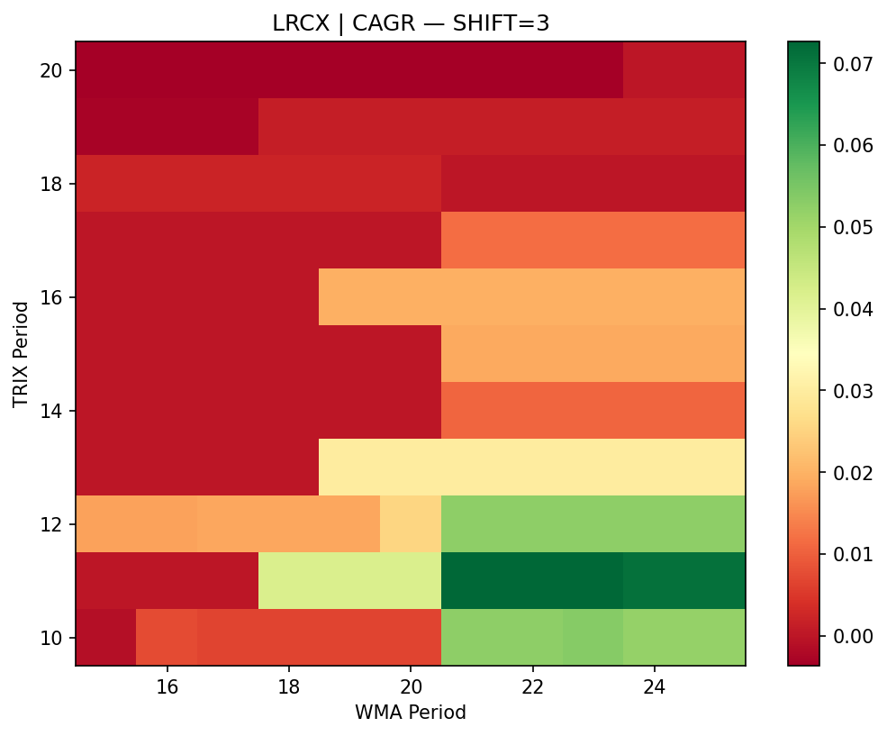
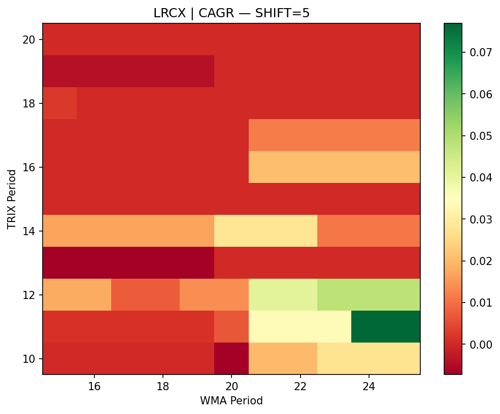
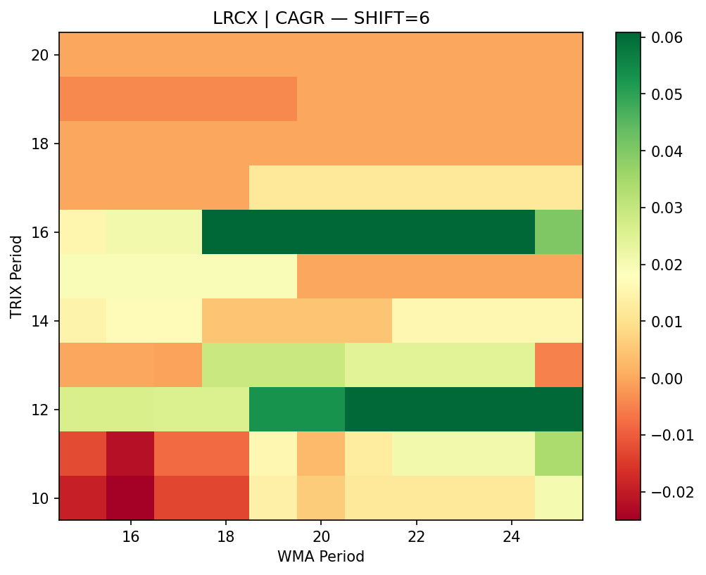
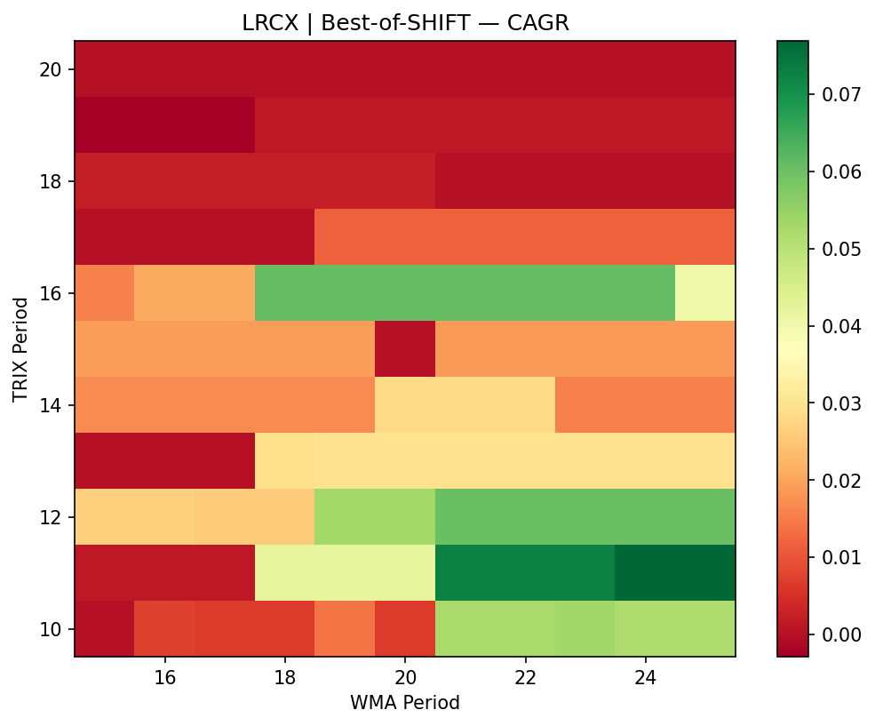
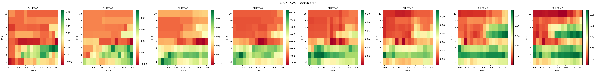
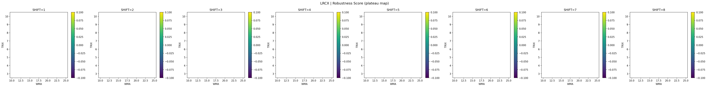
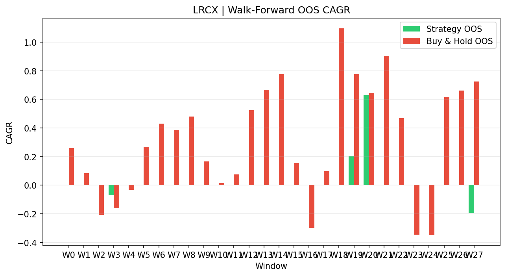
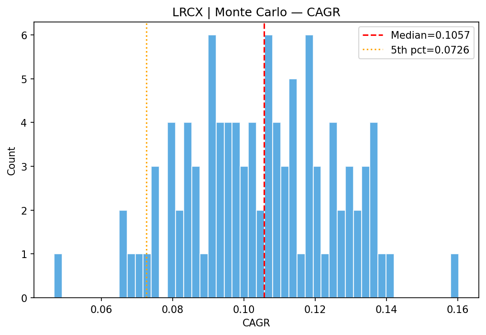
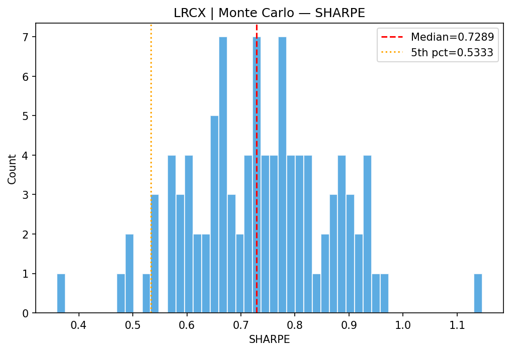

# TRIX + WMA Robustness Evaluation Report

**Primary Ticker:** LRCX

## 1. Problem Framing

Optimizing a trading strategy on a 2D parameter grid (TRIX period × WMA period) often produces a **single bright pixel** that looks impressive in-sample but is fragile: small parameter changes destroy performance.

By adding the SHIFT dimension and evaluating a 3D grid, we expose how that bright pixel fragments across timing perturbations. The solution is to find **plateaus** — regions where the *neighborhood* of parameters performs consistently well.

## 2. Strategy Definition

- **WMA(period):** Weighted Moving Average with linearly increasing weights.

- **TRIX(period):** 1-bar % change of triple-smoothed EMA.

- **Entry:** Pullback condition (WMA_t < WMA_{t−shift}) AND TRIX crosses above 0.

- **Exit:** TRIX crosses below 0.

- **Execution:** Signals at close of bar t → fill at open of bar t+1 (no lookahead).

- **Frictions:** Fees + slippage applied at execution.

## 3. Buy-and-Hold Baseline

| Metric | Buy & Hold |
|--------|---------|
| total_return | 28.0711 |
| cagr | 0.1838 |
| ann_vol | 0.4071 |
| sharpe | 0.4516 |
| max_dd | -0.7499 |
| calmar | 0.2451 |
| n_trades | 1 |
| win_rate | 1.0000 |
| avg_trade_ret | 28.0711 |
| exposure | 1.0000 |

## 4. 2D Grid Results

### Best-of-SHIFT Projection

## 5. 3D Results — Fragmentation Across SHIFT

## 6. Plateau Scoring

Score = w₁·norm(median_alpha_CAGR) − w₂·norm(|median_MaxDD|) + w₃·norm(median_Sharpe)
 − w₄·norm(std_alpha_CAGR) + w₅·frac_beating_BH

## 7. Walk-Forward OOS Results

| Window | Test Period | Params | OOS CAGR | OOS Sharpe | OOS MaxDD | Beats BH |
|--------|------------|--------|----------|-----------|----------|----------|
| W0 | 2010-01-11→2011-01-03 | T14/W20/S5 | 0.0000 | 0.000 | 0.0000 | False |
| W1 | 2010-07-13→2011-07-01 | T14/W20/S5 | 0.0000 | 0.000 | 0.0000 | False |
| W2 | 2011-01-10→2012-01-03 | T15/W15/S6 | 0.0000 | 0.000 | 0.0000 | True |
| W3 | 2011-07-12→2012-07-03 | T14/W15/S6 | -0.0693 | -0.376 | -0.2059 | True |
| W4 | 2012-01-10→2013-01-03 | T12/W25/S4 | 0.0000 | 0.000 | 0.0000 | True |
| W5 | 2012-07-11→2013-07-03 | T12/W25/S4 | 0.0000 | 0.000 | 0.0000 | False |
| W6 | 2013-01-10→2014-01-03 | T12/W25/S4 | 0.0000 | 0.000 | 0.0000 | False |
| W7 | 2013-07-11→2014-07-03 | T12/W25/S4 | 0.0000 | 0.000 | 0.0000 | False |
| W8 | 2014-01-10→2015-01-02 | T12/W25/S4 | 0.0000 | 0.000 | 0.0000 | False |
| W9 | 2014-07-11→2015-07-02 | T16/W16/S6 | 0.0000 | 0.000 | 0.0000 | False |
| W10 | 2015-01-12→2015-12-31 | T16/W15/S6 | 0.0000 | 0.000 | 0.0000 | False |
| W11 | 2015-07-13→2016-07-01 | T16/W15/S6 | 0.0000 | 0.000 | 0.0000 | False |
| W12 | 2016-01-11→2017-01-03 | T16/W15/S6 | 0.0000 | 0.000 | 0.0000 | False |
| W13 | 2016-07-12→2017-07-03 | T16/W15/S6 | 0.0000 | 0.000 | 0.0000 | False |
| W14 | 2017-01-10→2018-01-03 | T16/W15/S6 | 0.0000 | 0.000 | 0.0000 | False |
| W15 | 2017-07-11→2018-07-03 | T11/W21/S4 | 0.0000 | 0.000 | 0.0000 | False |
| W16 | 2018-01-10→2019-01-03 | T11/W21/S4 | 0.0000 | 0.000 | 0.0000 | True |
| W17 | 2018-07-11→2019-07-03 | T11/W21/S4 | 0.0000 | 0.000 | 0.0000 | False |
| W18 | 2019-01-10→2020-01-03 | T11/W21/S4 | 0.0000 | 0.000 | 0.0000 | False |
| W19 | 2019-07-11→2020-07-02 | T11/W24/S5 | 0.2007 | 1.236 | -0.0738 | False |
| W20 | 2020-01-10→2020-12-31 | T11/W24/S5 | 0.6287 | 1.810 | -0.1130 | False |
| W21 | 2020-07-13→2021-07-02 | T11/W24/S5 | 0.0000 | 0.000 | 0.0000 | False |
| W22 | 2021-01-11→2022-01-03 | T11/W24/S5 | 0.0000 | 0.000 | 0.0000 | False |
| W23 | 2021-07-13→2022-07-01 | T11/W24/S5 | 0.0000 | 0.000 | 0.0000 | True |
| W24 | 2022-01-10→2023-01-03 | T12/W19/S6 | 0.0000 | 0.000 | 0.0000 | True |
| W25 | 2022-07-12→2023-07-03 | T10/W21/S6 | 0.0000 | 0.000 | 0.0000 | False |
| W26 | 2023-01-10→2024-01-03 | T13/W18/S6 | 0.0000 | 0.000 | 0.0000 | False |
| W27 | 2023-07-11→2024-07-03 | T12/W19/S6 | -0.1937 | -1.763 | -0.1909 | False |

## 8. Multi-Asset Results

| Ticker | TRIX | WMA | SHIFT | Score | CAGR | α-CAGR | Sharpe | MaxDD | BH CAGR | Beats BH |
|--------|------|-----|-------|-------|------|--------|--------|-------|---------|----------|
| LRCX | nan | nan | nan | — | — | — | — | — | 0.1838 | False |
| AAPL | nan | nan | nan | — | — | — | — | — | 0.3203 | False |
| MSFT | nan | nan | nan | — | — | — | — | — | 0.1694 | False |
| NVDA | nan | nan | nan | — | — | — | — | — | 0.3902 | False |
| AMZN | nan | nan | nan | — | — | — | — | — | 0.2577 | False |
| GOOGL | nan | nan | nan | — | — | — | — | — | 0.2003 | False |
| META | nan | nan | nan | — | — | — | — | — | 0.2329 | False |
| JPM | nan | nan | nan | — | — | — | — | — | 0.1239 | False |
| XOM | nan | nan | nan | — | — | — | — | — | 0.0722 | False |
| SPY | nan | nan | nan | — | — | — | — | — | 0.1024 | False |
| QQQ | nan | nan | nan | — | — | — | — | — | 0.1449 | False |
| GLD | nan | nan | nan | — | — | — | — | — | 0.0899 | False |

**Fraction beating BH:** 0.0%

## 9. Monte Carlo Stress Results

### CAGR
- Median: 0.0765
- 5th percentile: 0.0715
- 95th percentile: 0.0773
- Std: 0.0075

### SHARPE
- Median: 0.5079
- 5th percentile: 0.4911
- 95th percentile: 0.5228
- Std: 0.0266

### MAX_DD
- Median: -0.1160
- 5th percentile: -0.1285
- 95th percentile: -0.1160
- Std: 0.0054

### TOTAL_RETURN
- Median: 3.3578
- 5th percentile: 2.9723
- 95th percentile: 3.4256
- Std: 0.4352

### N_TRADES
- Median: 5.0000
- 5th percentile: 4.0000
- 95th percentile: 5.0000
- Std: 0.3410

**Probability of underperforming Buy & Hold:** 100.0%

## 10. Verdict

**❌ NO-GO** — Strategy does not demonstrate sufficient robustness. Plateau performance degrades out-of-sample or under stress. Further research needed.
